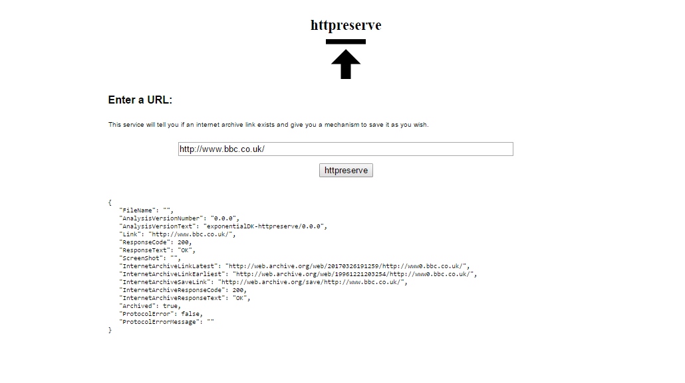

<div>
<p align="center">

</p>
</div>

# httpreserve

[](https://godoc.org/github.com/httpreserve/httpreserve)
[](https://goreportcard.com/report/github.com/httpreserve/httpreserve)

A tool to check the status of a weblink and also see whether it is archived
in the [Internet Archive](https://archive.org/).

Try it out here [httpreserve.info](http://httpreserve.info)

## Default Server

The library comes with a default server mode that can be configured for
POST and GET requests. POST by default. Default port is :2040 but this can
also be selected at runtime.



The default server can also be stood up as a web service. The API is
documented below.

## Client

The httpreserve linstat client is a separate application offering simple access
to httpreserve functionality through the command line. See [linkstat][ls-1]

[ls-1]: https://github.com/httpreserve/linkstat

The client application is a work in progress. Stay tuned for more
information about its capabilities.

## API

Primary entry point when the server is running:

*http://{httpreserve-ip-address}:{port}/httpreserve*

or

*http://{httpreserve-ip-address}:{port}/save*

**GET** example:

* Return JSON struct with information about the service you requested:

    [http://<i>{httpreserve-ip-address}:{port}</i>/httpreserve?url=http://www.google.com&filename=filename.txt][example-1]

[example-1]: http://httpreserve.info/httpreserve?url=http://www.google.com&filename=filename.txt

* Manage a save request to the internet archive and return HTTPreserve struct:

    [http://<i>{httpreserve-ip-address}:{port}</i>/save?url=http://www.google.com&filename=filename.txt][example-2]

[example-2]: http://httpreserve.info/httpreserve?url=http://www.google.com&filename=filename.txt

**POST** example:

    Same access point, but encode url and filename in a <i>application/x-www-form-urlencoded</i> form.

**OPTIONS** example:

    `curl -X OPTIONS http://httpreserve.info | less`

**RETURN** value:

'application/json' struct to work with, e.g.

```json
        {
        "AnalysisVersionNumber": "0.0.15",
        "AnalysisVersionText": "exponentialDK-httpreserve/0.0.15",
        "SimpleRequestVersion": "httpreserve-simplerequest/0.0.4",
        "Link": "http://example.com/",
        "Title": "example domain",
        "ContentType": "text/html; charset=UTF-8",
        "ResponseCode": 206,
        "ResponseText": "Partial Content",
        "SourceURL": "http://example.com/",
        "ScreenShot": "snapshots are not currently enabled",
        "InternetArchiveLinkEarliest": "http://web.archive.org/web/20020120142510/http://example.com/",
        "InternetArchiveEarliestDate": "2002-01-20 14:25:10 +0000 UTC",
        "InternetArchiveLinkLatest": "http://web.archive.org/web/20230526145524/https://example.com/",
        "InternetArchiveLatestDate": "2023-05-26 14:55:24 +0000 UTC",
        "InternetArchiveSaveLink": "http://web.archive.org/save/http://example.com/",
        "InternetArchiveResponseCode": 302,
        "InternetArchiveResponseText": "Found",
        "RobustLinkEarliest": "<a href='http://web.archive.org/web/20020120142510/http://example.com/' data-originalurl='http://example.com/' data-versiondate='2002-01-20'>HTTPreserve Robust Link - simply replace this text!!</a>",
        "RobustLinkLatest": "<a href='http://web.archive.org/web/20230526145524/https://example.com/' data-originalurl='http://example.com/' data-versiondate='2023-05-26'>HTTPreserve Robust Link - simply replace this text!!</a>",
        "PWID": "urn:pwid:archive.org:2023-05-26T14:55:24Z:page:http://example.com/",
        "Archived": true,
        "Error": false,
        "ErrorMessage": "",
        "StatsCreationTime": "883.557598ms"
        }
```

## Archiving Weblinks

* [Find and Connect Project:][laurent-1] Nicola Laurent on the impact of broken links.
* [Binary Trees? Automatically Identifying the links between born digital records:][spencer-1] I write about hyperlinks as a public record in own right when submitted as part of a documentary heritage.

## Robust links and Persistent Web Identifiers

HTTPreserve tries to promote the use of emerging standards such as Mementoweb's
Robust Links and the Royal Danish Library's Persistent Web-Identifiers (PWIDs).

More information about those can be found at the links below:

* [Robust Links][robust-1]
* [PWIDs][pwid-1]

## License

GNU General Public License Version 3. [Full Text](LICENSE)

[laurent-1]: http://www.findandconnectwrblog.info/2016/11/broken-links-broken-trust/
[spencer-1]: https://www.youtube.com/watch?v=Ked9GRmKlRw
[robust-1]: https://robustlinks.mementoweb.org/spec/
[pwid-1]: https://www.iana.org/assignments/urn-formal/pwid
